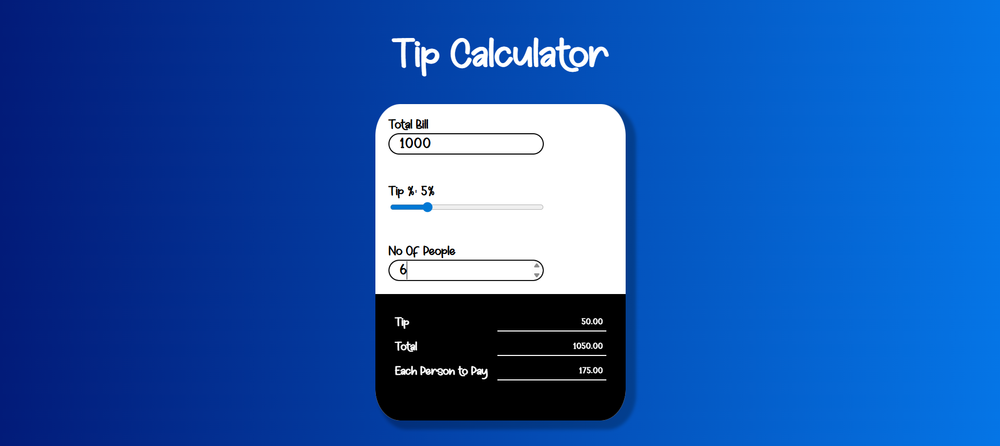

# 💸 Tip Calculator

A simple Tip Calculator to split bills and calculate tips instantly.

## 🔗 Live Demo
👉 [tipcalculatorx.netlify.app](https://tipcalculatorx.netlify.app/)

## 📸 Screenshot


## 🛠️ Features
- Real-time tip calculation
- Adjustable tip percentage slider
- Bill split between multiple people
- Clean and responsive UI

## 🧰 Built With
- HTML
- CSS
- JavaScript

## 🚀 Getting Started

### 1. Clone the Repository
```bash
git clone https://github.com/sandman-sh/tipcalculator.git
